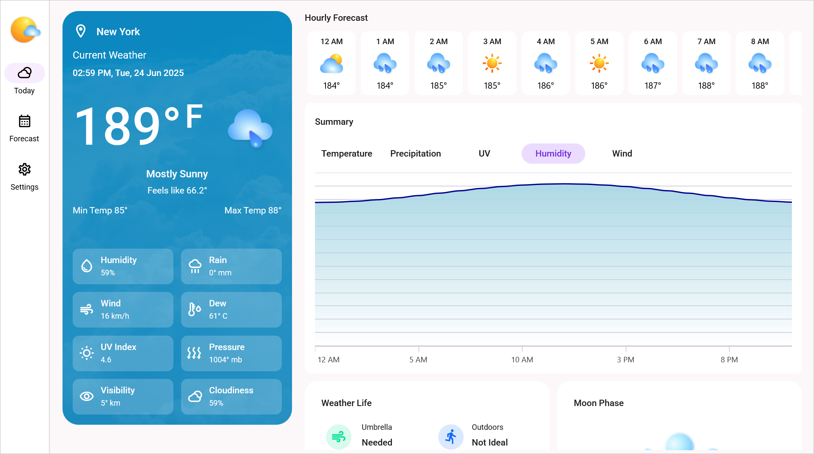

# Create Weather Analysis application in .NET MAUI platform 

This repository includes sample project that demonstrate the .NET MAUI Weather Analysis application using various Syncfusion components, such as [SfDataGrid](https://www.nuget.org/packages/Syncfusion.Maui.DataGrid), [SfCartesianChart](https://www.nuget.org/packages/Syncfusion.Maui.Charts), [SfListView](https://www.nuget.org/packages/Syncfusion.Maui.ListView), [SfSegmentedControl](https://www.nuget.org/packages/Syncfusion.Maui.Buttons), [SfEffectsView](https://www.nuget.org/packages/Syncfusion.Maui.Core), [SfTabView](https://www.nuget.org/packages/Syncfusion.Maui.TabView), and [SfComboBox](https://www.nuget.org/packages/Syncfusion.Maui.Inputs).

## Application Home Page

## Supported platforms

.NET Multi-platform App UI (.NET MAUI) apps can be written for the following platforms:

* Android 8.0 or higher.
* iOS 15 or higher, using the latest release of Xcode.
* macOS 15.1 or higher, using Mac Catalyst.
* Windows 11 and Windows 10 version 1809 or higher, using [Windows UI Library (WinUI) 3](https://learn.microsoft.com/en-us/windows/apps/winui/winui3/).

## System Requirements

Refer to the following link for more details: [System Requirements](https://help.syncfusion.com/maui/system-requirements)

## How to run the sample

1. Clone the sample and open it in Visual Studio 2022 preview.

   *Note: If you download the sample using the "Download ZIP" option, right-click it, select Properties, and then select Unblock.*

2. Register your license key in the App.cs file as demonstrated in the following code.

		public App()
		{
			//Register Syncfusion license
			Syncfusion.Licensing.SyncfusionLicenseProvider.RegisterLicense("YOUR LICENSE KEY");
		
			InitializeComponent();
		
			MainPage = new MainPage();
		}
		
	Refer to this [link](https://help.syncfusion.com/maui/licensing/overview) for more details.

3. Clean and build the application.

4. Run the application.

## License

Syncfusion has no liability for any damage or consequence that may arise from using or viewing the samples. The samples are for demonstrative purposes. If you choose to use or access the samples, you agree to not hold Syncfusion liable, in any form, for any damage related to use, for accessing, or viewing the samples. By accessing, viewing, or seeing the samples, you acknowledge and agree Syncfusion’s samples will not allow you seek injunctive relief in any form for any claim related to the sample. If you do not agree to this, do not view, access, utilize, or otherwise do anything with Syncfusion’s samples.